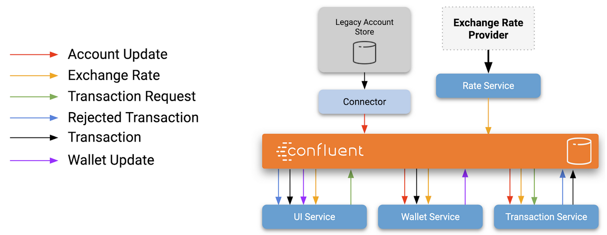

# Microservice Solution Definition

* [Project description](#project-description)
* [Featured languages](#featured-languages)
* [Featured Confluent Platform components](#featured-confluent-platform-components)
* [The application](#the-application)
* [Features](#features)
* [Functional Architecture](#functional-architecture)
* [Deployment instructions](#deployment-instructions)
* [Development instructions](#development-instructions)

## Project description

This project is a showcase of how the Confluent Platform can help building Event Driven Microservice architectures.

Implementing Confluent Platform with microservices help with the following topics:

* Simplified integration
* Complete decoupling
* Contracts

## Featured languages

* Java (Spring Boot)
* C# (Aspnet core)
* Golang (Gin-Gonic)
* Typescript (Angular)

## Featured Confluent Platform components

- [X] Kafka Clients
- [X] Schema Registry
- [ ] Replicator
- [ ] RBAC
- [ ] KSQL
- [ ] Rest Proxy
- [ ] MQTT Proxy

## The application

This project simulates a simple Crypto currency trading platform. Users can create an account, deposit funds with traditionnal currencies and trade it with crypto currencies at the rate from the current market.

## Features

- [ ] Create an account
- [X] Deposit funds from a fake credit card
- [X] Withdraw funds to a fake bank account
- [X] Consult wallets for all currencies
- [X] Display all operations on every wallet
- [X] Exchange currencies

## Functional Architecture

### Wallet Service - Dotnet core

Tracks operations from users and compute in real time the balance of all currencies of an account.

### Operation Service - Golang

Holds the history of all transaction for all accounts.

### Rate Service (Spotter) - Java

Provides real time exchange rates for all currencies.

### Graphical User Interface - Typescript

Allows interraction with all the micro services.

## Deployment instructions

- [Docker compose](doc/deployment/docker-compose.md)

## Development instructions

* [Rate Service](doc/dev/rate-service.md)
* [Transaction Service](doc/dev/transaction-service.md)
* [Wallet Service](doc/dev/wallet-service.md)
* [UI Service](doc/dev/ui-service.md)